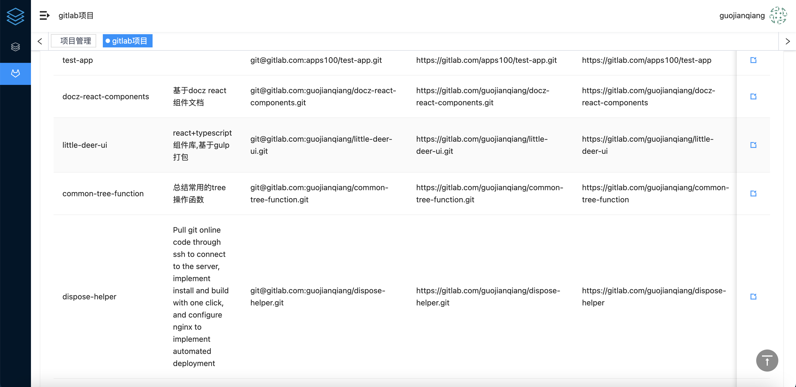
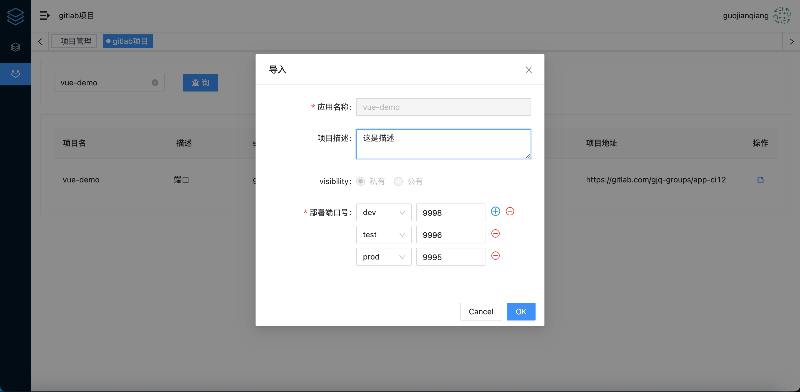
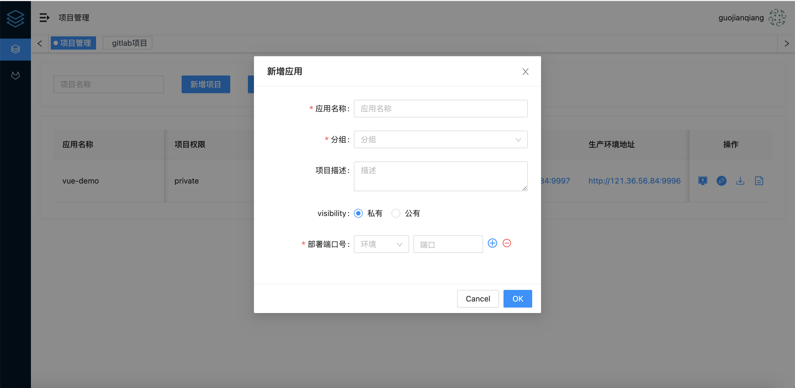
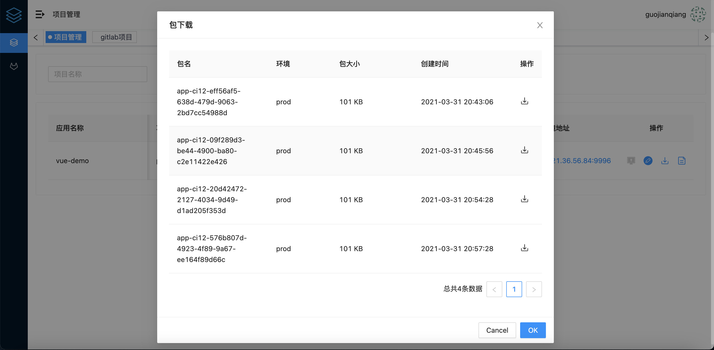
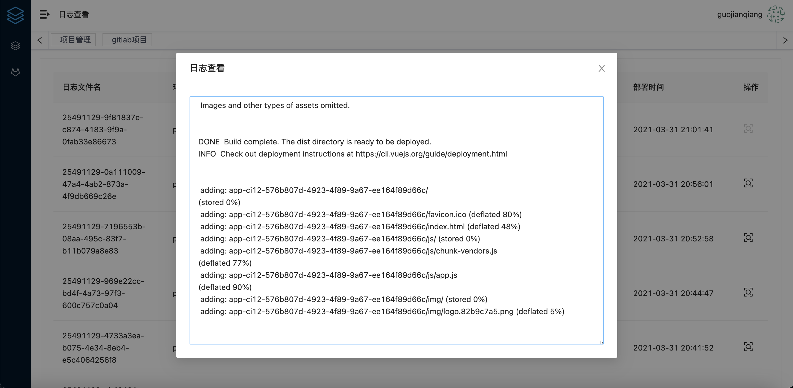
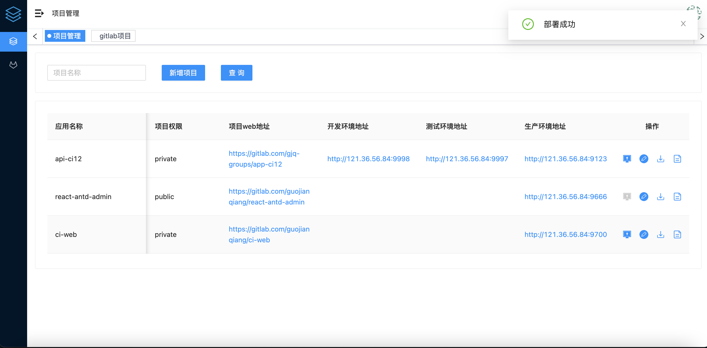

# auto-deploy-web 前端自动化构建平台

## 初衷
目前主流前端框架 *vue*、 *angular*、*react*的开发模式基本一致的情况下,打包部署的操作都是基于npm脚本。想必大家每次部署项目都要经历过相同的安装依赖打包传包到服务器的过程，基于这种情况下，开发此平台用于方便团队中部署项目的频繁操作，每次部署都会从代码远程仓库获取最新代码一键部署。从而解放大家的双手，并减少人为错误的发生。

## 使用到的技术
### ci-web

- react
- typescript
- [Ant Design](https://ant.design/index-cn)

### ci-server
- koa2 搭建http服务器
- [ws](https://github.com/websockets/ws) 搭建websocket服务器
- mysql 数据库
- [sequelize](https://sequelize.org/) 连接数据库工具

## 项目介绍


### 登录
绑定gitlab用户access_token,如何创建详情请查看[gitlab docs](https://docs.gitlab.com/ee/user/profile/personal_access_tokens.html)。获取到access_token后请保存到本地, 目前服务器未做gitlab代理。数据库未做用户权限管理。
。获取到access_token后请保存到本地, 目前服务器未做gitlab代理。数据库未做用户权限管理。

### gitlab导入
平台会调用gitlab授权用户项目的列表，支持用户导入gitlab项目。并设置基础信息和部署该项目nginx端口(dev、test、production)





### 项目部署
- 新建项目并导入gitlab。

  

- 支持项目部署包的下载，方便用户进行内网部署

  

- 支持日志查看功能,便于用户查看部署报错信息，快速定位错误

  

- 使用websocket服务端主动推送消息提示

  

  

## 如何部署配置该项目

**部署的前端项目package.json中的scripts应有以下命令，用的不同环境拉取不同分支代码和打包环境配置**

```jso
"scripts": {
    "build:dev": "...",
    "build:test": "...",
    "build:prod": "...",
  },
```

### ci-web

修改env目录中的配置文件

```json
{
  "SERVER_URL": "http://localhost:3000", // http服务器地址
  "WS_SERVER_URL": "ws://localhost:3000", // websocket 服务器地址
  "GITLAB_URL": "https://gitlab.com/api/v4" // gitlab api地址 部署修改为自己内网部署的gitlab地址
}
```

```shell
npm install // 安装依赖
npm run dev // 启动项目
npm run build:dev // 打包
```

[http://localhost:8000](http://localhost:8000/app_management)

### ci-server

修改config目录文件

```js
module.exports = {
  port: 3000, // 服务器端口
  environment: process.env.NODE_ENV || 'development',
  prefix: '/api/v1', // api前缀
  database: { // 数据库配置，需提前创建好数据库，无需建表，项目启动会自动创建
    dbName: 'ci',
    host: '127.0.0.1',
    port: 3306,
    user: 'root',
    password: 'admin123'
  },
  security: {
    secretKey: "secretKey",
    // 过期时间 1小时
    expiresIn: 60 * 60
  },
  ssh_server: { // 前端项目部署地址， 部署本项目的服务器需要与另外一台服务器实现互信免密登录
    host: '121.36.56.84',
    port: 22,
    username: 'root'
  },
  // 日志存放目录
  log_dir: '/logs',
  // 项目打包文件目录
  project_dir: '/projects',
  // nginx配置地址
  deploy_dir: {
    dev: '/web/dev',
    test: '/web/test',
    prod: '/web/prod'
  },
  upload_file: '/public/upload-file'
}
```

```shell
npm install
npm run dev
```

